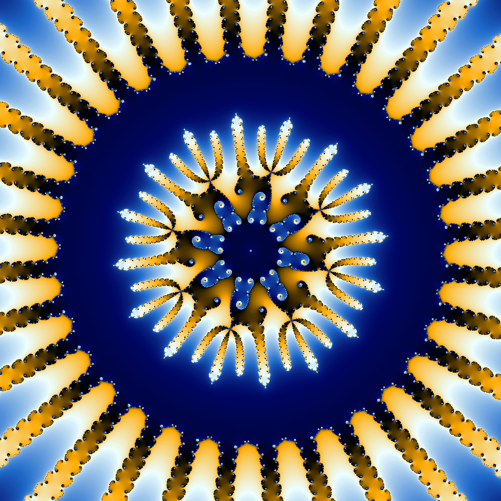

# rust-fractal
A mandelbrot fractal image generator featuring purturbation theory. A high precision reference point is iterated at arbitrary precision and the differences from this are calculated in machine precision. This allows for a large speedup in image generation specifically at high zoom levels. This generator is written in rust and features:
