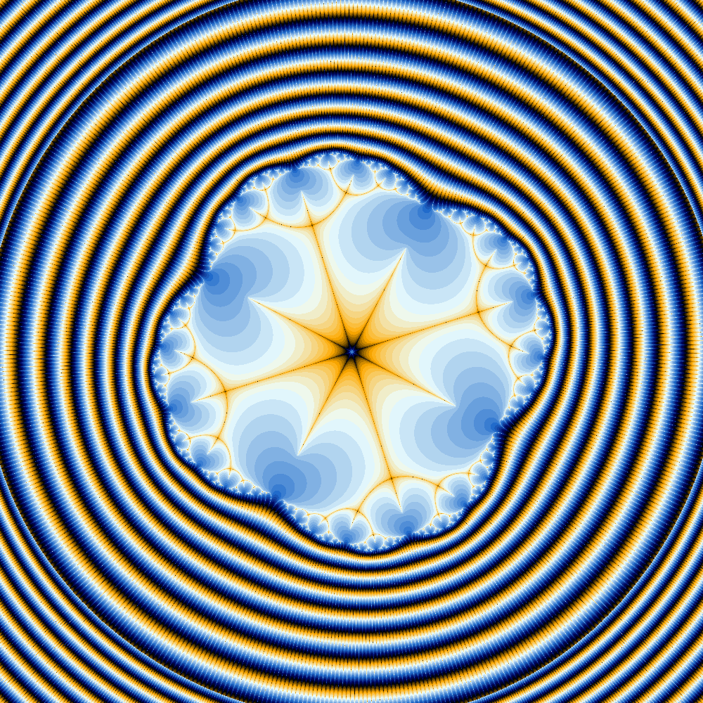

# rust-fractal
A mandelbrot fractal image generator featuring perturbation theory. A high precision reference point is iterated at arbitrary precision and the differences from this are calculated in machine precision. This allows for a large speedup in image generation specifically at high zoom levels. This generator features:

- Perturbation based iteration count with glitch detection.
- Glitch fixing through automatic reference movement and recalculation.
- Swappable types for use with perturbation, f32 and f64 which can go up to around a zoom level of 1e290.
- Multithreading of core perturbation loop through rayon.
- SIMD acceleration functions which (particularly with large iteration counts) can allow for 1.5 - 2.0x performance improvement.
- Multiple colouring methods including smoothed iteration count and histogram.

## Usage
In order to change the fractal settings you need to be able to compile rust using the gnu-nightly toolchain. This is a dependency of the packed-simd crate. Furthermore, you need to be able to complie the rug crate. Look in the documentation for rug for more information on how to do this. Once all required dependencies have been installed, change the settings in the ```main.rs``` file located in ```src/```. Build and run the crate with:

```cargo run --release```
